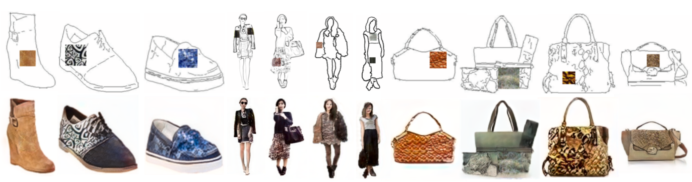

# TextureGAN
This code is our PyTorch implementation of TextureGAN
[[Project]](https://texturegan.eye.gatech.edu)   [[Arxiv]](https://arxiv.org/abs/1706.02823)


 
TextureGAN is a generative adversarial network conditioned on sketch and colors/textures. Users “drag” one or more example textures onto sketched objects and the network realistically applies these textures to the indicated objects.

## Setup

### Prerequisites
- Linux or OSX
- Python 2.7
- NVIDIA GPU + CUDA CuDNN 

### Dependency
- Visdom
- Ipython notebook
- Pytorch 0.2 (torch and torchvision)
- Numpy scikit-image matplotlib etc.

### Getting Started
- Clone this repo
```bash
git clone git@github.com:janesjanes/texturegan.git
cd texturegan
```
- Prepare Datasets
Download the training data:
```bash
wget https://s3-us-west-2.amazonaws.com/texturegan/training_handbag.tar.gz
tar -xvcf training_handbag.tar.gz
```
For shoe: https://s3-us-west-2.amazonaws.com/texturegan/training_shoe.tar.gz

For cloth: https://s3-us-west-2.amazonaws.com/texturegan/training_cloth.tar.gz

- Train the model from scratch. See python main.py --help for training options. Example arguments (see the paper for the exact parameters value):
```bash
python main.py --display_port 7779 --gpu 3 --model texturegan --feature_weight 5e3 --pixel_weight_ab 1e4 
--global_pixel_weight_l 5e5 --local_pixel_weight_l 0 --style_weight 0 --discriminator_weight 5e5 --discriminator_local_weight 7e5  --learning_rate 5e-4 --learning_rate_D 1e-4 --batch_size 36 --save_every 100 --num_epoch 100000 --save_dir [./save_dir] 
--data_path [training_handbags_pretrain/] --learning_rate_D_local  1e-4 --local_texture_size 50 --patch_size_min 20 
--patch_size_max 50 --num_input_texture_patch 1 --visualize_every 5 --num_local_texture_patch 5
```
Models will be saved to `./save_dir`  

See more training details in section Train

You can also load our pretrained models in section Download Models.

To view results and losses as the model trains, start a visdom server for the ‘display_port’ 
```bash
python -m visdom.server -port 7779
```


Test the model

- See our Ipython Notebook Test_script.ipynb

## Train
TextureGAN proposes a two-stage training scheme. 
- The first training state is ground-truth pre-training. We extract input edge and texture patch from the same ground-truth image. Here, we show how to train the ground-truth pretrained model using a combination of pixel loss, color loss, feature loss, and adverserial loss. 
```bash
python main.py --display_port 7779 --gpu 0 --model texturegan --feature_weight 10 --pixel_weight_ab 1e5 
--global_pixel_weight_l 100 --style_weight 0 --discriminator_weight 10 --learning_rate 1e-3 --learning_rate_D 1e-4 --save_dir
[/home/psangkloy3/handbag_texturedis_scratch] --data_path [./save_dir] --batch_size 16 --save_every 500 --num_epoch 100000 
--input_texture_patch original_image --loss_texture original_image --local_texture_size 50 --discriminator_local_weight 100  
--num_input_texture_patch 1
```

- The second stage is external texture fine-tuning. This step is important for the network to reproduce textures for which we have no ground-truth output (e.g. a handbag with snakeskin texture). This time, we extract texture patch from an external texture dataset (see more in Section Download Dataset). We keep the feature and adversarial losses unchanged, but modify the pixel and color losses, to compare the generated result with the entire input texture from which input texture patches are extracted. We fine tune on previous pretrained model with addition of local texture loss by training a separate texture discriminator.  
```bash
python main.py --display_port 7779 --load 1500 --load_D 1500 --load_epoch 222 --gpu 0 --model texturegan --feature_weight 5e3
--pixel_weight_ab 1e4 --global_pixel_weight_l 5e5 --local_pixel_weight_l 0 --style_weight 0 --discriminator_weight 5e5 
--discriminator_local_weight 7e5  --learning_rate 5e-4 --learning_rate_D 1e-4 --batch_size 36 --save_every 100 --num_epoch
100000 --save_dir [skip_leather_handbag/] --load_dir [handbag_texturedis_scratch/] 
--data_path [./save_dir] --learning_rate_D_local  1e-4 --local_texture_size 50 --patch_size_min 20 --patch_size_max 50 
--num_input_texture_patch 1 --visualize_every 5 --input_texture_patch dtd_texture --num_local_texture_patch 5
```

## Download Datasets
The datasets we used for generating sketch and image pair in this paper are collected by other researchers. Please cite their papers if you use the data. 
The dataset is split into train and test set.
- Shoes dataset: ## training images from [UT Zappos50K dataset](http://vision.cs.utexas.edu/projects/finegrained/utzap50k/). 
- Hangbags dataset: ## Amazon Handbag images from [iGAN project](https://github.com/junyanz/iGAN). 
- Deep Fashion Dataset: ## clothes images from [Deep Fashion Dataset](http://mmlab.ie.cuhk.edu.hk/projects/DeepFashion.html). 

Edges are computed by [HED](https://github.com/s9xie/hed) edge detector + post-processing. [[Citation](datasets/bibtex/handbags.tex)]

The datasets we used for inputting texture patches are DTD Dataset and leather dataset we collected from the internet.
- DTD Dataset: 
- Leather Dataset: 

## Download Models
Pre-trained models 
- <a href='https://s3-us-west-2.amazonaws.com/texturegan/textureD_final_allloss_shoes_200.pth' >For shoe model</a>  
- <a href='https://s3-us-west-2.amazonaws.com/texturegan/textureD_final_allloss_handbag_3300.pth' > For handbag model </a>
- <a href=https://s3-us-west-2.amazonaws.com/texturegan/final_cloth_finetune.pth'> For clothe model </a>

## Citation
If you find it this code useful for your research, please cite: 

"TextureGAN: Controlling Deep Image Synthesis with Texture Patches"

[Wenqi Xian](http://wqxian.com), [Patsorn Sangkloy](https://www.cc.gatech.edu/~psangklo/),   Varun Agrawal, Amit Raj, Jingwan Lu, Chen Fang, Fisher Yu, James Hays in CVPR, 2018.
```
@article{xian2017texturegan,
  title={Texturegan: Controlling deep image synthesis with texture patches},
  author={Xian, Wenqi and Sangkloy, Patsorn and Agrawal, Varun and Raj, Amit and Lu, Jingwan and Fang, Chen and Yu, Fisher and Hays, James},
  journal={arXiv preprint arXiv:1706.02823},
  year={2017}
}
```


